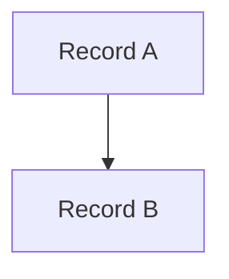

# Mermaid.js Diagrams for Salesforce

The [mermaid.js diagramming engine](https://mermaid.js.org/intro/) can convert text representations into beautiful, dynamically generated diagrams. The library is based on D3.js, but does not work with Salesforce out of the box. This repo demonstrates how to implement the library correctly.


## Features

- Embed Mermaid diagrams in LWCs, Screen Flows, and Record Pages.
- Render any Mermaid diagram except `Gantt` and `Zenuml`.
- Click on diagram nodes to open records or fire [custom events]((#making-diagrams-interactive)).
- Format data from anywhere (API, Query, Apex) and visualize using plain text [mermaid syntax](https://mermaid.js.org/syntax/flowchart.html).

## Use Cases

| Flow Diagrams | Entity Relation Diagrams  | Class Diagrams | Sequence Diagrams | Gitflow Diagrams  |
|---|---|---|---|---|
| Show dependencies between records, metadata components, classes, etc.  | Dynamically render data models from `sObjectDescribe`, `rest`, or `tooling` APIs.  | Dynamically render class dependencies and relationships. | Generate integration flow diagrams. | Dynamically render branches and commits. |
|  |  |   |  |  |

## Getting Started

Deploy the repo into an org:

```bash
sf org create scratch -a mermaid -f config/project-scratch-def.json -d -y 30
sf project deploy start
sf org assign permset -n UseMermaidDiagramEditor
sf org open -p /lightning/n/MermaidDiagramEditor
```

The sample app page will present two examples:

1. A wrapper LWC with a `lightning-textarea` to provide input
2. A wrapper Screen Flow with a flow text area to provide input

### Embed in a Lightning Web Component

To use in a component, pass mermaid syntax text into the `graph-definition` html attribute:

```html
<template>
    <lightning-textarea name="textArea" label="Diagram Input" value={textArea} onchange={handleChange}></lightning-textarea>
    <c-mermaid-diagram graph-definition={textArea}></c-mermaid-diagram>
</template>
```

### Embed in a Screen Flow

To use in a flow, pass mermaid syntax text into the `Graph Definition` flow attribute:


### Embed in a Record Page

To use in a record page, pass a record ID into a flow, query the target text area field, and pass it into the Graph Definition flow attribute. Optionally, update the diagram in flow and update the record text area field.

**Embed Flow in Record Page**


**View Diagram**


**Edit Diagram**


### Make Diagram Interactive
Diagram types that support the `click` callback can be used to open related pages, records, or custom actions when a diagram node is clicked.


A basic harness for record page navigation has been implemented if a clickable diagram node ID uses a record ID.

Sample Diagram:



```text
graph TD
0017i00001Yntu5AAB[Record A]
0037i00001FQuKjAAL[Record B]
0017i00001Yntu5AAB --> 0037i00001FQuKjAAL
click 0017i00001Yntu5AAB call callback() "This will open Record A"
click 0037i00001FQuKjAAL call callback() "This will open Record B"
```

## Considerations

### Supported Diagrams

The following diagrams seem to work correctly: `Flowchart`, `Sequence`, `Class`, `State`, `Entity Relationship`, `User Journey`, `Pie Chart`, `Quadrant Chart`, `Requirement Diagram`, `Gitgraph (Git) Diagram`, `C4 Diagram`, `Mindmaps`, `Timeline`, `Sankey`, `XYChart`, `Block Diagram`.
  - `Gantt` and `Zenuml` diagrams do not work at all.
  - `Quadrant` diagram labels do not align correctly.

### HTML Rendering

The `htmlLabels: false` config setting does not currently work and text will disappear due to an issue with xhtml and svg namespace conflicts. This limits the amount of style customizations that can be achieved by CSS overrides.

### Static Resource Compatibility

The standard `mermaid.min.js` file uses a `structuredClone()` method, which is unsupported in LWC/LWS ([Issue 5538](https://github.com/mermaid-js/mermaid/issues/5538)). A viable workaround is to find and replace all references with a simple JSON object copy:

```bash
# Download the latest version of mermaid.js
npm i mermaid@10.9.0
# Copy the minified file to overwrite the current static resource
cp node_modules/mermaid/dist/mermaid.min.js force-app/main/default/staticresources/mermaid.js
# Replace all `structuredClone()` methods with a simple `JSON.parse(JSON.stringify())` object copy:
sed -i '' 's/structuredClone(/JSON.parse(JSON.stringify(/g' force-app/main/default/staticresources/mermaid.js
# Push the updated static resource to the org
sf project deploy start
```

## Resources

- [Mermaid.js Documentation](https://mermaid.js.org/intro/getting-started.html)
- [Mermaid.js MIT License](https://github.com/mermaid-js/mermaid/blob/develop/LICENSE)
- [Mermaid.js NPM repository](https://www.npmjs.com/package/mermaid)